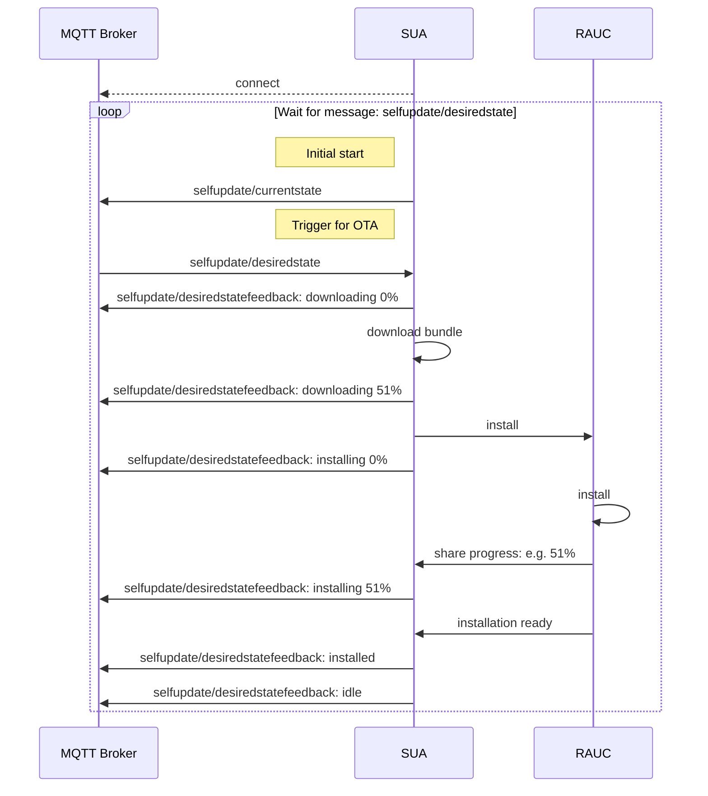
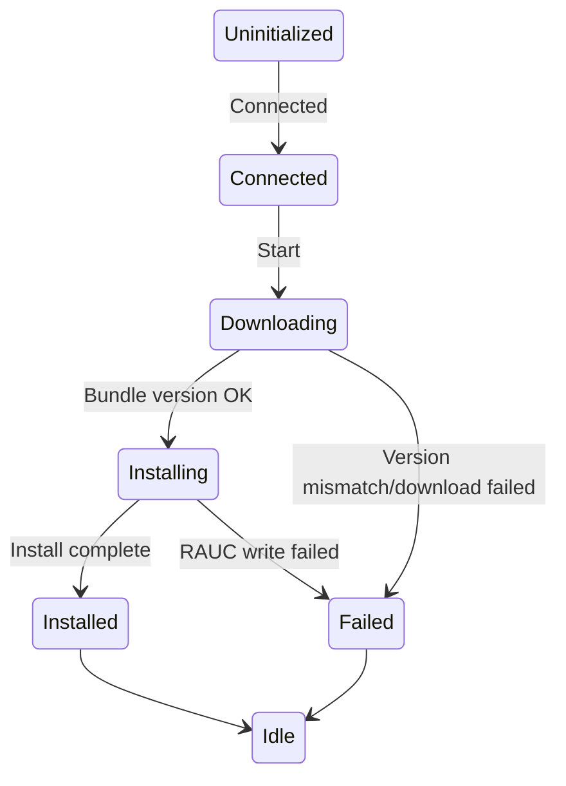

# License
Apache 2.0

# Contribution
Follow guidelines from Eclipse Leda: https://eclipse-leda.github.io/leda/docs/project-info/contribution-guidelines

# Security Policy
This project implements the Eclipse Foundation Security Policy: https://www.eclipse.org/security

# Reporting a Vulnerability
Please report vulnerabilities to the Eclipse Foundation Security Team at security@eclipse.org

# Data privacy notice:
Data privacy notice is here: [link](docs/data-privacy-notice.md)

# SDV Self Update Agent
The self update agent (SUA) is a component responsible for the OS Update process. 
SUA is communicating on MQTT interface via usage of defined messages. Internally, SUA uses [RAUC](https://rauc.io/) to perform the update. 

Following sequence diagram shows the happy path example of communication between components. 




Important: Uninitialized state is the default entry state or state in case connection is lost. To simplify reading of the diagram arrows from other states to Unitialized have been removed.

MQTT communication is done via 3 MQTT topics:

## selfupdate/desiredstate
| Topic | Direction | Description |
|-------|  -------- | ----------- |
| selfupdate/desiredstate | IN | This message triggers the update process. The payload shall contain all data necessary to obtain the update bundle and to install it. |

## selfupdate/currentstate
| Topic| Direction | Description |
|------|  -------- | ----------- |
| selfupdate/currentstate | OUT | This message is being sent either once on SUA start or as an answer to response received by selfupdate/currentstate/get. It contains information about currently installed OS version. |

## selfupdate/currentstate/get
| Topic| Direction | Description |
|------|  -------- | ----------- |
| selfupdate/currentstate/get | IN | This message can be received at any point of time. Indicates that SUA should send back version of installed OS as current state. |

## selfupdate/desiredstatefeedback
| Topic| Direction | Description |
|------|  -------- | ----------- |
| selfupdate/desiredstatefeedback | OUT | This message is being sent by SUA to share current progress of triggered update process. This is the *OUT* counterpart of *selfupdate/desiredstate* input message. |

SUA supports 2 protocols depending on configuration: [link](docs/k8s.md) for Kubernetes-based Custom Objects or [link](docs/bfb.md) for Update Agent API.Default protocol is bfb.

# Checkout
SUA links to some 3rd party libraries, which are fetched as submodules, therefore the cloning shall be performed with recursive option:

```
git clone --recursive https://github.com/eclipse-leda/leda-contrib-self-update-agent.git
```
or if was cloned non recursively
```
git submodule init
git submodule update
```

# HowTo Build
Instructions for building are available on: [link](docs/building/README.md)

# HowTo Deploy
Instructions for deploying are available on: [link](docs/deploying/README.md)

# HowTo Test
Instructions for testing are available on: [link](docs/testing/README.md)
